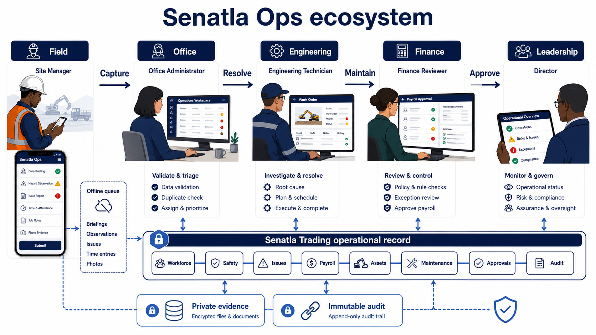
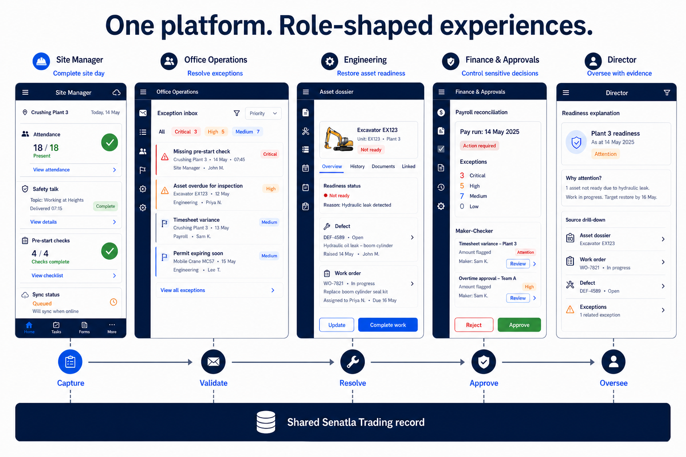
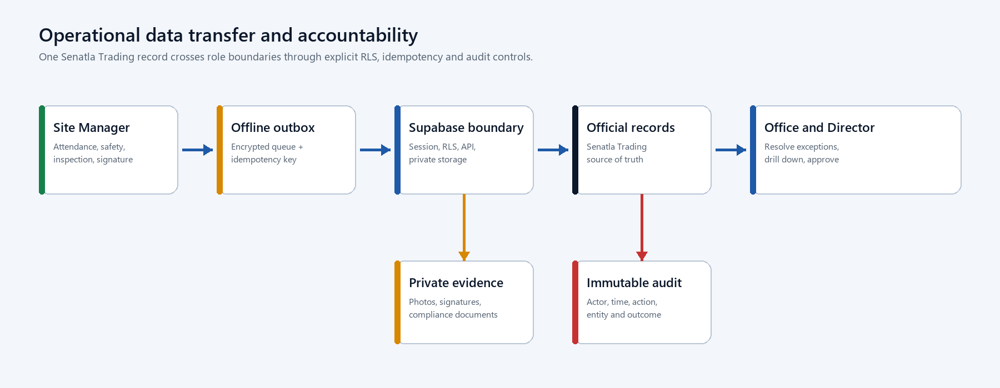
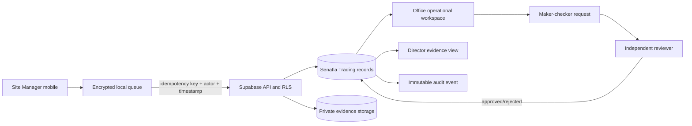
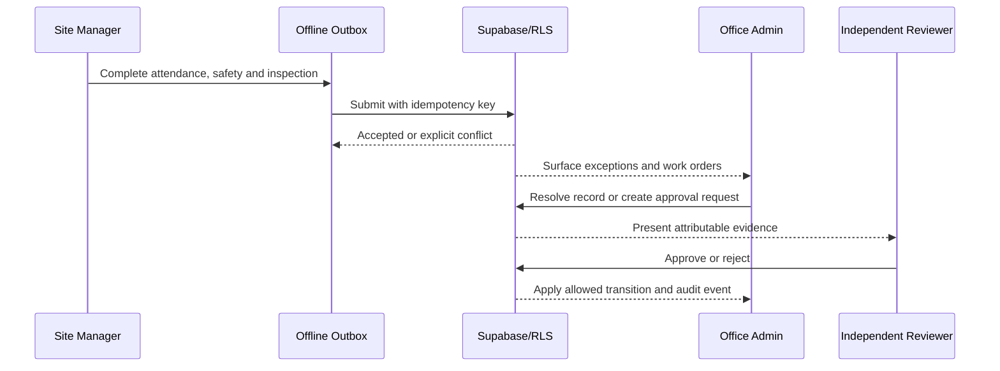
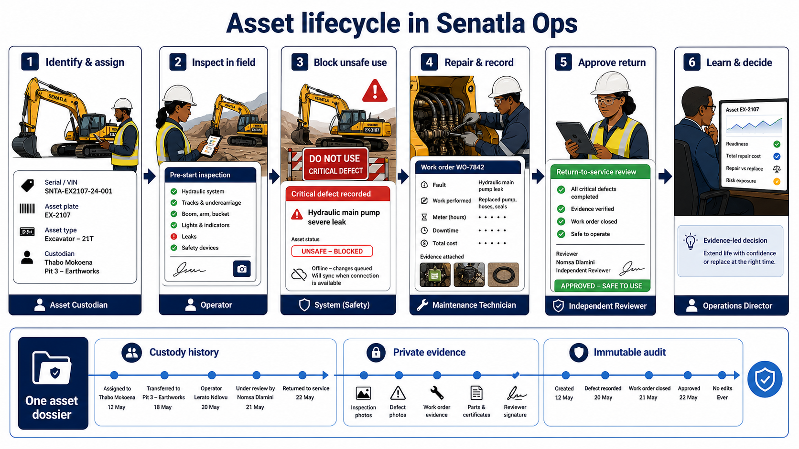
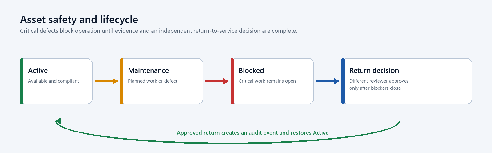
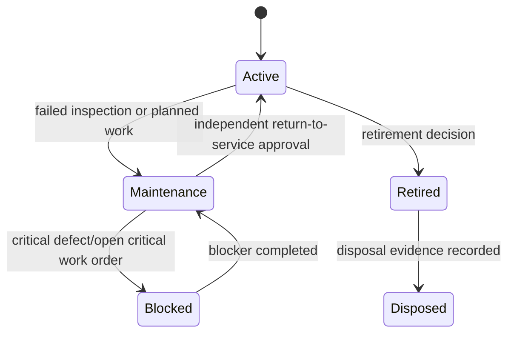

# Senatla Ops Client Planning, Requirements and Guidance Blueprint

**Client:** Senatla Trading  
**Prepared by:** Sankofa Digital Studio  
**Version:** 1.0  
**Date:** 23 June 2026  
**Classification:** Confidential - client planning document

## 1. Executive direction

Senatla Ops should become the internal operating heartbeat for Senatla Trading. It should answer five questions without reconstructing information across spreadsheets and messages:

1. Are people present, safe and synchronized?
2. Which operational exceptions require action now?
3. Where is each asset, who is responsible for it and is it safe to use?
4. Which financial and approval controls are unresolved?
5. Can every decision be traced to an attributable source record?

The public Senatla Trading website remains frozen and outside this programme. The first controlled release has one legal owner, Senatla Trading. Engineering is a functional label until a later organizational separation decision.

## 2. The ecosystem at a glance

Senatla Ops is one connected operating system, not a collection of dashboards. Field teams capture events where work happens; office staff validate and resolve exceptions; engineering restores asset readiness; Finance applies sensitive controls; leadership oversees the operation through traceable evidence. All roles work against one Senatla Trading operational record.

The diagram separates responsibility without separating the source of truth. The offline queue protects field continuity, private evidence storage protects documents and images, and the immutable audit preserves who did what and when.

## 3. Product principles

- Evidence before appearance: every score links to source records.
- Exceptions before dashboards: urgent work appears ahead of decorative metrics.
- Offline is a normal state: queued work is visible and recoverable.
- One accountable owner: custody, approvals and actions identify a person and time.
- Rules before AI: readiness and escalation remain explainable.
- Mobile and desktop are sibling experiences, not a reduced afterthought.
- Personal information is minimized, masked and accessed only for an approved purpose.

## 4. Stakeholders and roles

| Role | Primary objective | Main experience | Controlled actions |
|---|---|---|---|
| Site manager | Complete the site day safely and accurately | Mobile-first field workflow | Attendance, safety talk, evidence, pre-start checks and daily sync |
| Office administrator | Resolve exceptions and maintain official records | Desktop operational workspace | Workforce, sites, issues, payroll, assets, maintenance and requests |
| Director | Understand operational position and approve assigned decisions | Evidence-first executive view | Read, drill down and maker-checker review |
| Engineering operations | Keep heavy machinery available and safe | Asset and maintenance workspace | Custody, meters, inspections, work orders and return-to-service requests |
| Finance reviewer | Reconcile payroll and sensitive exports | Controlled finance workflow | Period review and assigned approvals |
| Technical lead | Protect delivery and recoverability | GitHub, CI, monitoring and runbooks | Release, rollback and incident coordination |

## 5. Functional requirements

| Priority | Capability | Requirement | Acceptance evidence |
|---|---|---|---|
| Must | Authentication and access | Expired, inactive and wrong-role sessions cannot access protected workspaces | Route and RLS negative tests |
| Must | Daily field operations | Attendance, absence reason, safety talk and signature form one attributable daily submission | Online and offline scenario |
| Must | Exception control | Missing evidence, late sync, critical issue and unsafe asset create actionable exceptions | Exception-to-resolution trace |
| Must | Workforce and sites | Official records support validation, archive history and bulk assignment | CRUD, archive and audit tests |
| Must | Payroll | Calculations reconcile; locks and completed approvals are immutable | Maker-checker and reconciliation tests |
| Must | Asset identity | At least one serial, VIN or plate is required and every populated value is unique | Duplicate and normalization tests |
| Must | Asset lifecycle | Custody, location, compliance, meters, retirement and evidence preserve history | Transfer and retirement trace |
| Must | Maintenance | Failed pre-start checks create defects/work orders; critical work blocks return to service | Inspection-to-approval trace |
| Must | Offline delivery | Idempotency prevents duplicates and conflicts remain visible | Retry and duplicate-submission tests |
| Must | Audit | Every mutation creates actor, time, organization, action and entity evidence | Mutation-to-audit contract |
| Should | Executive evidence | Readiness, cost, downtime and compliance reconcile to persisted records | Metric reconciliation sheet |
| Should | QR lookup | QR opens the asset dossier but does not replace authoritative identifiers | Scan and manual fallback test |
| Could | Repair-versus-replace | Decision card combines downtime, repair cost, meter and replacement estimate | Explainable calculation review |
| Later | Spares and procurement | Parts consumption and stock support work orders | Separate approved phase |
| Later | Telematics and AI | External meters and prediction follow proven data quality | Separate security and ROI case |

## 6. Role-shaped application experiences

The same platform presents a different first task to each role. The Site Manager completes the site day; Office Operations resolves exceptions; Engineering restores asset readiness; Finance controls sensitive decisions; the Director oversees with evidence. Handoffs are visible and remain linked to the shared record.

These concepts establish information architecture and responsibility, not final visual styling. Detailed interaction and accessibility design will be validated with users at each release gate.

### 6.1 Required screen family

| Screen | Primary reading path | Key action |
|---|---|---|
| Operational command | Readiness explanation -> exceptions -> site rows -> evidence | Open highest-risk exception |
| Site day | Connectivity -> attendance -> safety -> inspections -> exceptions | Review and submit sync |
| Workforce | Search -> site/group -> employee status -> history | Update or archive official record |
| Issues | Severity/SLA -> owner -> evidence -> resolution history | Assign, escalate or resolve |
| Payroll | Period -> reconciliation -> adjustments -> approvals -> export history | Lock or request controlled export |
| Asset register | Identifier lookup -> dossier -> custody/compliance -> maintenance | Record lifecycle action |
| Maintenance | Due/critical queue -> work order -> parts/cost -> return approval | Complete safe return workflow |
| Approvals | Request evidence -> separation check -> decision | Approve or reject with reason |
| Director view | Period/site -> actual values -> exceptions -> source drill-down | Review evidence, not edit records |
| Audit | Actor/time/action/entity -> filter -> retained evidence | Export authorized audit evidence |

## 7. Data handling and transfer

### 7.1 Operational data flow

The client never receives a service-role credential. Supabase validates the session and RLS before data reaches Postgres or Storage. Local queues retain failed items until the server confirms the idempotency key. Readiness metrics are derived views over persisted records and never become a second source of truth.

### 7.2 Role transfer sequence

### 7.3 Data classification

| Class | Examples | Handling guidance |
|---|---|---|
| Operational | Sites, issues, asset states and work orders | Authenticated access, RLS and audit |
| Personal | Employee identity, attendance and evidence | Purpose limitation, masking and restricted export |
| Financial | Rates, adjustments and payroll exports | Office/Finance access, maker-checker and immutable periods |
| Safety evidence | Photos, inspections and signatures | Private storage, retention policy and controlled download |
| Security | Sessions, audit events and incident records | Restricted access, append-only evidence and monitoring |
| Configuration | Public runtime URL and publishable key | No secrets; environment-specific generation |
| Secret | Service-role key and deployment credentials | Server/CI secret store only; never browser, Git or documents |

## 8. Asset and maintenance story

The asset workflow is one continuous story. The same excavator dossier follows identification, field inspection, safety blocking, engineering repair, independent return approval and leadership review. Custody, evidence and audit do not reset when responsibility changes.

### 8.1 Controlled lifecycle states

Custody and meter readings are append-only. Retirement does not delete the dossier. QR codes locate the dossier; serial, VIN and plate remain the legal/operational identity controls.

## 9. Delivery plan and client decisions

| Gate | Client-visible outcome | Sign-off |
|---|---|---|
| 0 - Baseline | Existing work is stabilized and evidence gaps are listed | Technical lead |
| A - Governed | GitHub workflow, CI, environments and runbooks are active | Engineering |
| B - Secure data | Single-owner migration and role-negative access tests pass | Engineering/Operations |
| C - Core operations | Site day, workforce, issues and payroll controls pass | Operations/Finance |
| D - Asset pilot | Selected assets import without duplicates and lifecycle history is traceable | Engineering operations |
| E - Maintenance | Critical inspection through approved return to service passes | Engineering operations |
| F - Production candidate | Monitoring, restore, UAT and documentation are signed | Engineering/Operations/Finance |

Client decisions required before Gate D are the pilot sites, pilot asset list, asset class vocabulary, custodians, evidence-retention periods and designated reviewers. These decisions should be captured as controlled configuration rather than hard-coded UI text.

## 10. Brainstormed enhancements

### Near-term, high value

- Operational heartbeat inbox that ranks exceptions by safety, payroll and downtime impact.
- Explainable asset readiness score showing compliance, open critical work, meter due and custody acknowledgement.
- Pre-start checklist templates by asset class, with conditional evidence and automatic defect creation.
- A shift handover view that records unresolved risks, assets down and next responsible person.
- Repair-versus-replace decision card using actual downtime, work-order cost and meter history.
- Data-quality dashboard for unidentified assets, duplicate people, missing owners and stale sites.
- Low-bandwidth evidence mode that compresses images, queues uploads and shows storage status.

### Medium-term, after pilot evidence

- Parts consumed per work order and minimum-stock alerts without building a full procurement ERP.
- Contractor and temporary-custody workflow with expiry and return acknowledgement.
- Warranty recovery tracker connecting work orders, warranty evidence and recovered value.
- Site-to-site asset reservation with conflict detection and transport handover.
- Scheduled compliance packs for roadworthy, insurance, certification and licence evidence.
- Notification preferences by severity and role, with escalation only after an unresolved threshold.

### Challenge before investment

- Telematics should proceed only when supported equipment coverage and integration cost are known.
- Predictive maintenance requires enough trustworthy meter, failure and cost history to outperform rules.
- AI summaries must cite source records, avoid personnel scoring and never make approval decisions.
- A full spares warehouse module should be bought or integrated if an existing product meets requirements better.
- Multi-company tenancy should wait until legal ownership and cross-company data-sharing rules are approved.

## 11. Acceptance and guidance

A release is not accepted because it builds. Acceptance requires role-negative security evidence, a clean migration reset, desktop/mobile workflow proof, metric reconciliation and recovery rehearsal. Demo or illustrative data must be labelled. Unverified checks remain open risks.

Sankofa should maintain the source Markdown, responsive HTML, Word document and PDF as one versioned package. The engineering handbook governs implementation; this client blueprint governs expectations, decisions and acceptance.
